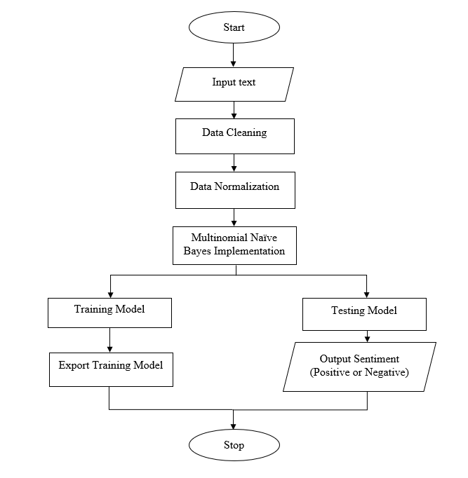
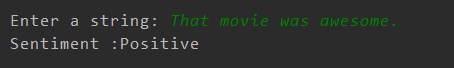
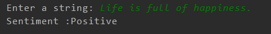
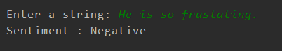
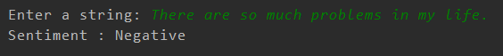

## Twitter-Sentiment-Analysis

### Description
Twitter Sentiment Analysis is a COMP 484 (Machine learning project) which is based on analysing and classifying tweets using Naive Bayes classifier.

### Dataset:
https://drive.google.com/drive/u/0/folders/1_bvCGIKXAtsQIGrVWtTXY1Rw9K3dLuIh

### Libraries Used:
- nltk (Natural Language Processing library)
- re (Regular Expression)

### Flow diagram:

### Implementation:
 
 

